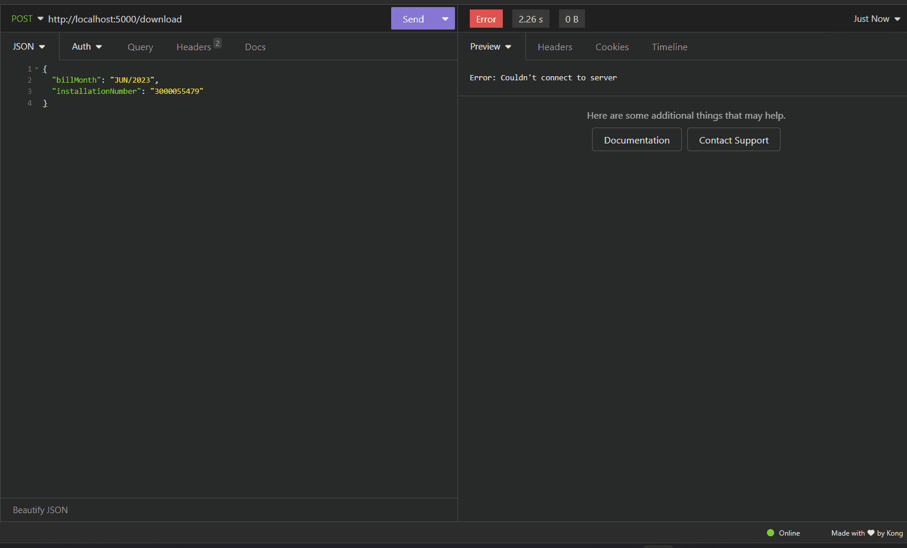

# PDF Service

Esta é uma api para o gerenciamento de dados de faturas de energia elétrica.

## :memo: Descrição

Etsa api foi desenvolvido em **[Python](https://www.python.org/)**, utilizando o framework **[Flask](https://flask.palletsprojects.com/en/3.0.x/)** para acelerar o processo de desenvolvimento; o scraper de pdf foi feito com **[PyPDF2](https://pypi.org/project/PyPDF2/)**.

<br/>

## Ambiente de Desenvolvimento

O projeto foi desenvolvido no seguinte ambiente:

- **Python 3.0.0**
- **Flask 3.0.0**
- **PyPDF2 3.0.1**

<br/>

## Como Executar o Projeto Localmente

> Para isso você precisa ter [Python](https://www.python.org/), [Git](https://git-scm.com/) e [Docker](https://www.docker.com/) instalados.

1. Clone este repositório.

```sh
git clone https://github.com/Lumi-challenge/pdf-service.git
```

2. Navegue até o diretório do projeto.

```sh
cd pdf-service
```

<br/>
<br/>

> **OBS:** caso deseje usar o docker siga esses passos:

1. Execute `docker compose up -d` para subir um container.

```sh
docker compose up -d
```

2. Após executar o container o serviço estará disponível na seguinte url: `http://localhost:5000`.

<br/>
<br/>

> **OBS:** caso não queira usar docker e rodar localmente siga esses passos:

1. Iniciar virtual env (dentro da pasta do projeto)

```sh
python -m venv venv
```

2. Inicializar virtual env

```sh
source venv/bin/activate
```

3. Instalando dependencias

```sh
pip install -r requirements.txt
```

4. Iniciando aplicação

```sh
python app.py
```

5. O serviço estará disponível na seguinte url: `http://localhost:5000`.

<br/>

## :books: Funcionalidades

### Retorna todos os dados de faturas

- **Descrição:** Retorna todos os dados de faturas já capturado do pdf e tratados.
  <br/><br/>
  
  <br/>
  <br/>
  <br/>
  <br/>

### Download da fatura de energia elética

- **Descrição:** Realiza o download da fatura passando o mês/ano e o Nº de instalação.
  <br/><br/>
  
  <br/>
  <br/>
  <br/>
  <br/>

## :wrench: Tecnologias utilizadas

✔ **[Python](https://www.python.org/)**

✔ **[Flask](https://flask.palletsprojects.com/en/3.0.x/)**

✔ **[PyPDF2](https://pypi.org/project/PyPDF2/)**

<br/>

## Contato

[Linked-in](https://www.linkedin.com/in/educoelhos/)

[Email](mailto:eduardocoelhosilva12@gmail.com)
